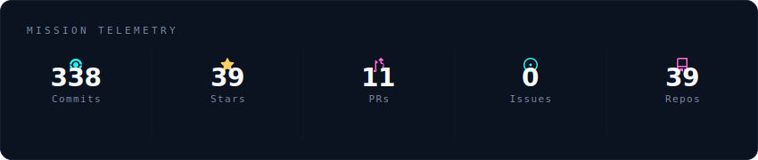
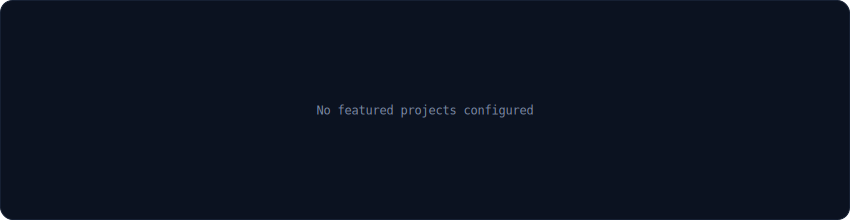

  

 

  

 

  

 

  

 

<strong>Mais sobre mim</strong>

 

Sou Pedro, estudante de Ciencias da Computacao e apaixonado por tecnologia.
Busco me aprofundar em projetos desafiadores e transformar ideias em realidade.
Curiosidade e determinacao me impulsionam a aprender mais todos os dias.

**Colaboracao:** Aberto para colaborar em projetos interessantes.

 

  
  
  
  

